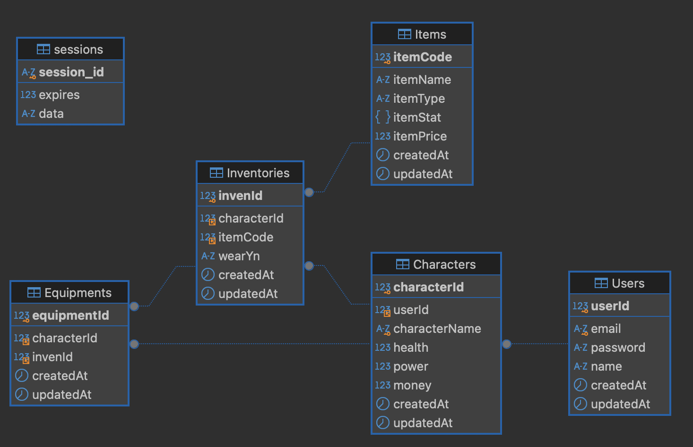

# Chapter 3, 개인과제 : 아이템 시뮬레이터

## 사용법

- 최초 실행 시

  - yarn 설치(global) : sudo npm install -g yarn
  - 의존성 및 패키지 설치 : yarn

- 실행 : yarn run start
- Swagger : yarn run swagger
- Site : ${domain}/

## 구조 
```
📁 ROOT
├── README.md
├── package.json
├── 📁 prisma
│   └── schema.prisma
├── 📁 src
│   ├── app.js
│   ├── 📁 middlewares
│   │   ├── auth.middleware.js
│   │   ├── authPage.middleware.js
│   │   └── error-handling.middleware.js
│   ├── 📁 routes
│   │   ├── character.router.js
│   │   ├── characterActions.router.js
│   │   ├── items.router.js
│   │   ├── pages.router.js
│   │   └── users.router.js
│   ├── 📁 swagger
│   │   ├── swagger-output.json
│   │   └── swagger.js
│   └── 📁 utils
│       ├── Utils.js
│       └── 📁 prisma
│           └── index.js
└── yarn.lock
```

## 필수 기능

- [x] 회원가입 API
- [x] 로그인 API
- [x] 캐릭터 생성 API (JWT 인증만 가능)
- [x] 캐릭터 삭제 API (JWT 인증만 가능)
- [x] 캐릭터 목록 조회 API (JWT 인증만 가능)
- [x] 캐릭터 상세 조회 API (JWT으로 기능 구분)
- [x] 아이템 생성 API
- [x] 아이템 수정 API
- [x] 아이템 목록 조회 API
- [x] 아이템 상세 조회 API

## 도전 기능

- [x] 게임머니 100 증가 API (JWT 인증만 가능)
- [x] 아이템 구입 API (JWT 인증만 가능)
- [x] 아이템 판매 API (JWT 인증만 가능)
- [x] 캐릭터가 보유한 인벤토리 내 아이템 목록 조회 API (JWT 인증만 가능)
- [x] 캐릭터가 장착한 아이템 목록 조회 API
- [x] 아이템 장착 API (JWT 인증만 가능)
- [x] 아이템 탈착 API (JWT 인증만 가능)

## API 명세서

[API 명세서 (Notion) ](https://dev-bong92.notion.site/3758f20ae7f04e3993743a97092442c4?v=13d7c277ee8c4f7c8a534e684a4e161b)

[Swagger-UI](http://vamuzz.shop:3020/api-docs)

## ERD



### 테이블 목록

| 구분 | 테이블명        | 테이블명(영문) | 설명                    |
| ---- | --------------- | -------------- | ----------------------- |
| 필수 | 회원 테이블     | Users          | 회원 정보               |
| 필수 | 아이템 테이블   | Items          | 아이템 정보             |
| 필수 | 캐릭터 테이블   | Characters     | 회원 캐릭터 정보 테이블 |
| 도전 | 인벤토리 테이블 | Inventories    | 캐릭터 소지품 테이블    |
| 도전 | 장비 테이블     | Equipments     | 캐릭터 착용장비 테이블  |

## 트러블 슈팅

- [AWS RDS 비용 관련](https://velog.io/@vamuzz/AWS-RDS-public%EC%97%90%EC%84%9C-private%EC%9C%BC%EB%A1%9C)
- [express-swagger](https://velog.io/@vamuzz/express-swagger%EC%84%A4%EC%A0%95%ED%95%98%EA%B8%B0)

---

## Q & A

### 1. 암호화 방식

Q, 비밀번호를 DB에 저장할 때 Hash를 이용했는데, Hash는 단방향 암호화와 양방향 암호화 중 어떤 암호화 방식에 해당할까요?

- 단방향 암호화

Q, 비밀번호를 그냥 저장하지 않고 Hash 한 값을 저장 했을 때의 좋은 점은 무엇인가요?

- 복호화할 수 없어서 보안성이 높다.

### 2. 인증 방식

Q, JWT(Json Web Token)을 이용해 인증 기능을 했는데, 만약 Access Token이 노출되었을 경우 발생할 수 있는 문제점은 무엇일까요?

- 다른 사용자가 사용할 수 있고, Token에 들어있는 데이터도 노출될 수 있음.

Q, 해당 문제점을 보완하기 위한 방법으로는 어떤 것이 있을까요?

- Access Token에 만료기간을 설정하여, 해당 토큰을 긴 시간 사용할 수 없게만든다.
- 토큰 내부에 유출되면 안되는 값을 넣지 않는다.
- 토큰 생성 시, 요청위치에 대한 정보를 저장하고 비교하고 아닌 경우, 블랙스트에 등록

### 3. 인증과 인가

Q, 인증과 인가가 무엇인지 각각 설명해 주세요.

- 인증(Authentication)
  - 서비스를 이용하려는 사용자가 인증된 신분을 가진 사람이 맞는지 검증하는 작업
  - 로그인 기능
- 인가(Authorization)
  - 인증된 사용자가 특정 리소스에 접근하거나 특정 작업을 수행할 수 있는 권한이 있는지를 검증하는 작업
  - 권한 확인

Q, 위 API 구현 명세에서 인증을 필요로 하는 API와 그렇지 않은 API의 차이가 뭐라고 생각하시나요?

- 인증을 필요로 하는 API의 경우, 특정 유저정보를 필요로 하는데 인증/인가를 통해 정보를 확인합니다.

Q, 아이템 생성, 수정 API는 인증을 필요로 하지 않는다고 했지만 사실은 어느 API보다도 인증이 필요한 API입니다. 왜 그럴까요?

- 유저의 권한이 아니라 관리자의 권한으로 확인해야한다고 생각합니다.
  하지만, 지금 구성되어있는 API에는 해당 관리자 관련처리가 안되어있기 때문이라고 생각합니다.

### 4. Htttp Status Code

Q, 과제를 진행하면서 사용한 Http Status Code를 모두 나열하고, 각각이 의미하는 것과 어떤 상황에 사용했는지 작성해 주세요.

- 200 OK

  - 요청이 성공했음을 나타내는 성공 응답 상태 코드입니다
  - 샤용된 상황
    - 캐릭터 상세 조회 : 성공
    - 캐릭터 목록 조회 : 성공
    - 캐릭터 삭제 : 성공
    - 게임머니 증가 : 성공
    - 인벤토리 목록 조회 : 성공
    - 아이템 장착 : 성공
    - 아이템 탈착 : 성공
    - 장착아이템 목록 조회 : 성공
    - 아이템 목록 조회 : 성공
    - 아이템 상세 조회 : 성공
    - 로그인 : 성공

- 201 Created

  - 요청이 성공적으로 처리되었으며, 자원이 생성되었음을 나타내는 성공 상태 응답 코드입니다
  - 사용된 상황
    - 캐릭터 생성 : 성공
    - 회원가입 : 성공
    - 아이템 생성 : 성공
    - 아이템 수정 : 성공

- 400 Bad Request

  - 서버가 클라이언트 오류(예: 잘못된 요청 구문, 유효하지 않은 요청 메시지 프레이밍, 또는 변조된 요청 라우팅) 를 감지해 요청을 처리할 수 없거나, 하지 않는다는 것을 의미합니다
    - 사용된 상황
      - 캐릭터 삭제 : 실패 - 캐릭터 정보 조회 실패
      - 캐릭터 상세 조회 : 실패 - 캐릭터 정보 조회 실패
      - 게임머니 증가 : 실패 - 캐릭터 정보 조회 실패
      - 아이템 구입 : 실패 - 캐릭터 정보 조회 실패
      - 아이템 판매 : 실패 - 캐릭터 정보 조회 실패
      - 인벤토리 목록 조회 : 실패 - 캐릭터 정보 조회 실패
      - 아이템 장착 : 실패 - 캐릭터 정보 조회 실패
      - 아이템 탈착 : 실패 - 캐릭터 정보 조회 실패
      - 캐릭터 장비 목록 조회 : 실패 - 캐릭터 정보 조회 실패

- 401 Unauthorized

  - 요청된 리소스에 대한 유효한 인증 자격 증명이 없기 때문에 클라이언트 요청이 완료되지 않았음을 나타냅니다
  - 사용된 상황
    - 인증 미들웨어 : 실패 - token 파싱 실패, 토큰 대상 미존재 등
    - 로그인 : 실패 - 아이디 또는 비밀번호 불일치 시

- 404 Not Found

  - 서버가 요청받은 리소스를 찾을 수 없다는 것을 의미합니다
  - 사용된 상황
    - 없는 페이지 조회

- 409 Conflict

  - 서버의 현재 상태와 요청이 충돌했음을 나타냅니다
  - 사용된 상황
    - 회원가입 : 이메일 중복 시 사용
    - 캐릭터 생성 : 캐릭터명 중복 시 사용
    - 아이템 장착 : 실패 - 이미 착용하고 있는 아이템
    - 아이템 탈착 : 실패 - 이미 해제하고 있는 아이템

- 500 Internal Server Error
  - 요청을 처리하는 과정에서 서버가 예상하지 못한 상황에 놓였다는 것을 나타냅니다.
  - 사용된 상황
    - 서버 오류 발생 시

### 5. 게임 경제

Q, 현재는 간편한 구현을 위해 캐릭터 테이블에 money라는 게임 머니 컬럼만 추가하였습니다.

Q, 이렇게 되었을 때 어떠한 단점이 있을 수 있을까요?

- 게임 머니에 관련된 행동이 잦을수록 캐릭터 테이블 조회에 대한 부담이 커질 수 있습니다.

Q, 이렇게 하지 않고 다르게 구현할 수 있는 방법은 어떤 것이 있을까요?

- 별도의 테이블로 관리합니다.

Q, 아이템 구입 시에 가격을 클라이언트에서 입력하게 하면 어떠한 문제점이 있을 수 있을까요?

- 구입 가격을 변조할 가능성이 있습니다.

---

## 어려웠던 점

- 에러 핸들링을 조금 더 세세하게 하고 싶었다.
- swagger를 조금 더 쉽게 하는 방법이 있었을 것 같은데, 더 찾아보지 못해서 아쉽다.

---

#### 캐릭터 이미지 출처

- <a href="https://kr.freepik.com/free-vector/hand-drawn-clip-art-people-office-worker-character_23374868.htm#fromView=keyword&page=1&position=3&uuid=adca9d95-7f05-4a0b-8bd7-ea072d02a20b">작가 felicities 출처 Freepik</a>
